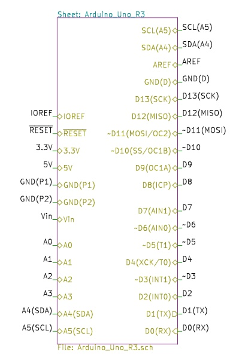
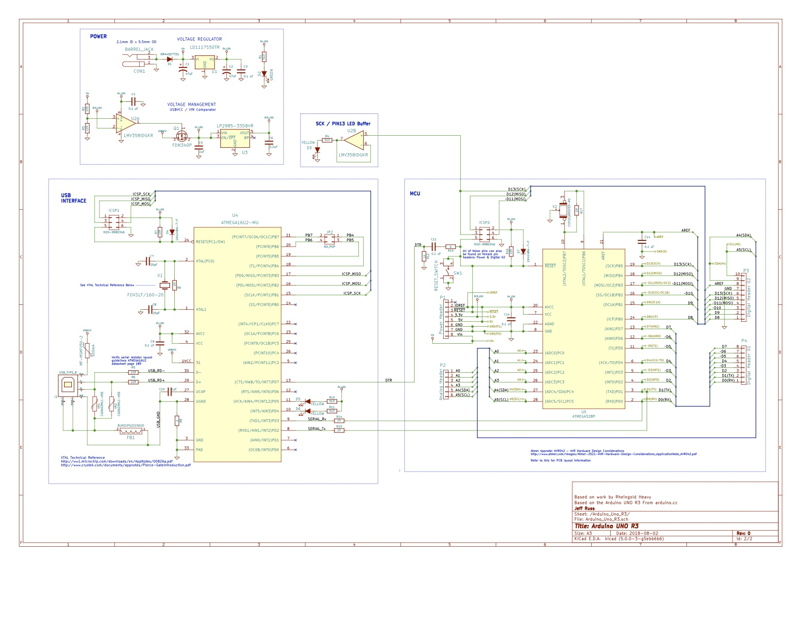

# Arduino Uno Kicad Template

This is a template for Kicad version 5 which could be used for:

1. Building a Arduino Uno Rev.3 clone
2. Designing a shield or module for the Uno
3. Designing anything using the ATmega328P with the Uno during prototyping

For items 2 & 3, this project can be used as a template by placing it in the user template directory for kicad. Unlike the template for the Arduino Uno that comes with Kicad 5, this contains the full schematic for the Uno as a sub-sheet as well as the Uno's BOM. The main sheet has connections to the subsheet just as you would see with the actual Uno's female pin headers. 

Inside it sub-sheet is the full schematic which could be keep intact if making a clone or whittled down to just what you need on the final design.  

  

The pcb has a head start for you if you are making a shield; it has some footprints in place for that (but not for the components of the Uno itself).

In addition to using this project as Kicad template in the formal sense you might also choose to start a project in your own way and then choose "`Append Schematic Sheet...`", choosing either Arduino_Uno_Template.sch` or `Arduino_Uno_R3.sch`. Just be sure to add the Arduino_Uno_R3 library from this project to yours!
